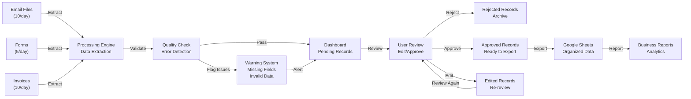
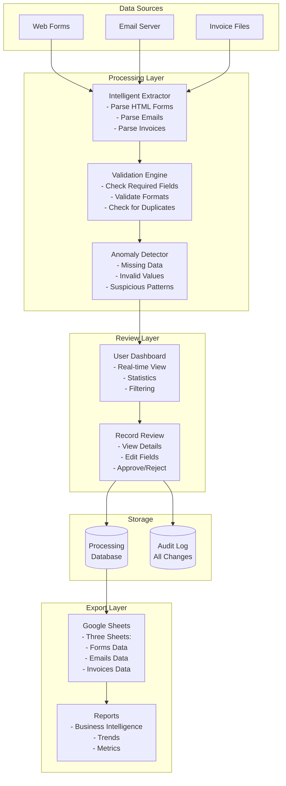
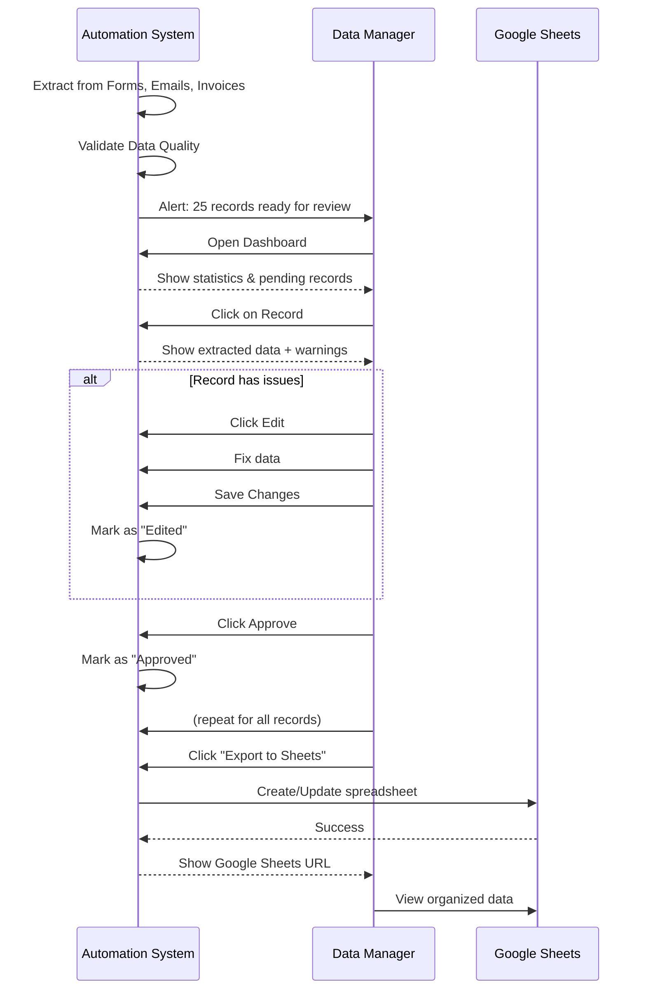

# Needs Analysis: TechFlow Solutions Data Automation

**Prepared for:** TechFlow Solutions  
**Project:** Business Process Automation System  
**Date:** November 2025  
**Prepared by:** AthenaGen AI Solutions Engineering Team

---

## Executive Overview

TechFlow Solutions, a mid-sized IT services company with 50-100 employees, is currently managing customer data and financial records through manual, time-consuming processes. This analysis identifies critical business problems and proposes a comprehensive technology solution to streamline operations, reduce errors, and improve productivity.

---

## 1. About TechFlow Solutions

**Company Profile:**

- **Industry:** Information Technology Services
- **Size:** 50-100 employees
- **Service Focus:** IT consulting, managed services, digital transformation
- **Current Challenge:** Manual data management across multiple sources

**Key Operations:**

- Daily customer inquiries through web forms
- Email communications with customers and vendors
- Invoice processing and financial tracking
- Customer data consolidation and reporting

---

## 2. The Problem: Current State Analysis

### 2.1 Current Workflow (Manual Process)

```
Customer Inquiry    Email from Client    Invoice Received
      ↓                   ↓                     ↓
   Website Form        Email Client         PDF Invoice
      ↓                   ↓                     ↓
   ↓↓↓ MANUAL WORK ↓↓↓
   - Operator reads data
   - Manually types into spreadsheet
   - Looks for invoice details
   - Enters financial info by hand
      ↓
   Google Sheets
   (Disorganized, Error-prone, Time-consuming)
```

### 2.2 Identified Pain Points

#### **1. Time Waste - 15-20 hours/week per employee**

- **Problem:** Each form/email requires manual data entry into Google Sheets
- **Impact:** Staff spending half their day on data entry instead of core business
- **Cost:** $750-1,000/week per employee in lost productivity

**Example Timeline:**

- Reading and understanding data: 2-3 minutes per record
- Manual typing into spreadsheet: 3-5 minutes per record
- Quality checking: 1-2 minutes per record
- **Total per record: 6-10 minutes**
- Processing 50+ records daily = 5-8 hours/day

#### **2. Error Rate - 10-15% of entries contain mistakes**

- **Problem:** Human error in manual data entry
- **Common Errors:**

  - Typos in customer names/emails
  - Wrong phone numbers or addresses
  - Incorrect invoice amounts
  - Duplicate entries
  - Missing critical information

- **Impact:**
  - Wrong customer communication
  - Financial discrepancies
  - Failed service deliveries
  - Customer dissatisfaction

#### **3. Data Inconsistency - Multiple, conflicting versions**

- **Problem:** Data scattered across emails, forms, and multiple spreadsheet versions
- **Issues:**
  - Same customer entered multiple times
  - Conflicting information (different phone numbers for same customer)
  - Impossible to find the "single source of truth"
  - Reports showing different numbers

#### **4. Integration Challenges - Multiple systems don't communicate**

- **Problem:** Forms, emails, and invoices stored in separate locations
- **Workflow:**
  - Forms saved locally on server
  - Emails buried in inboxes
  - Invoices scattered across email attachments
  - Manual consolidation required
- **Risk:** Data loss, missed information, compliance issues

#### **5. Decision-Making Bottleneck - No real-time visibility**

- **Problem:** Leadership can't quickly see business metrics
- **Challenges:**
  - Waiting for manual reports (1-2 days delay)
  - Can't answer "How many leads today?" without checking manually
  - Can't identify patterns or trends quickly
  - Delayed response to business opportunities

#### **6. Scaling Impossibility**

- **Problem:** Process can't scale with business growth
- **Current:** 50 records/day = manageable pain
- **Growth scenario:** 200 records/day = impossible to manage
- **Result:** Must hire more staff just for data entry, increasing costs

---

## 3. Business Impact & Financial Cost

### 3.1 Quantified Cost of Current State

**Monthly Impact:**

| Factor                         | Amount               | Calculation                                           |
| ------------------------------ | -------------------- | ----------------------------------------------------- |
| **Labor Cost (Data Entry)**    | $16,000-20,000       | 2 FTE × $50K annual salary × 40% time on data entry   |
| **Error Correction Cost**      | $2,000-3,000         | 10% errors × $100-150 per correction effort           |
| **Duplicate Processing**       | $1,500-2,000         | Wasted effort on duplicate entries                    |
| **Opportunity Cost**           | $5,000-7,000         | Staff unavailable for revenue-generating work         |
| **Customer Satisfaction Loss** | $3,000-5,000         | Missed follow-ups, wrong contacts, poor service       |
| **System Inefficiency**        | $2,000-3,000         | Manual workarounds, email searches, file organization |
| **TOTAL MONTHLY COST**         | **$29,500-40,000**   |                                                       |
| **ANNUAL COST**                | **$354,000-480,000** |                                                       |

### 3.2 Annual Impact at Scale

If TechFlow grows to processing 200 records/day (current 50/day × 4):

- **Annual cost increases to:** $1.4M - $1.9M
- **Staff required:** 8-10 full-time employees just for data entry
- **Salary burden:** $400K-500K+ annually

---

## 4. Technical Assessment

### 4.1 Data Sources Overview

**1. Customer Forms (HTML)**

- Location: Company website
- Frequency: 5-10 per day
- Fields: Name, Email, Phone, Company, Service Interest, Message, Date
- Reliability: Structured, predictable

**2. Email Communications (.eml files)**

- Type A: Client inquiries (8+ per day)
  - Fields: Sender name, email, contact details, inquiry details
  - Challenge: Unstructured, varies by sender
- Type B: Invoice notifications (2-3 per day)
  - Fields: Invoice number, sender, reference information
  - Challenge: Mixed with other emails

**3. Invoice Documents**

- Format: Currently HTML-based (PDF in real-world scenario)
- Frequency: 5-10 per day
- Fields: Invoice #, Date, Customer name, Amount, Tax, Total, Payment terms
- Reliability: Structured, standardized format

### 4.2 Technical Requirements

**Data Must Be:**

- Automatically extracted from all three sources
- Validated for accuracy and completeness
- Organized with human review capability
- Stored in a centralized, accessible location
- Exportable to Google Sheets (client requirement)
- Auditable (who approved what, when)

**System Must:**

- Prevent automatic export of bad data
- Flag suspicious or incomplete records
- Allow human review and editing before finalization
- Track all changes and decisions
- Generate reports on processing

---

## 5. Proposed Solution Architecture

### 5.1 System Overview

```
DATA SOURCES                PROCESSING LAYER           REVIEW & APPROVAL       OUTPUT
├─ Forms (HTML)    →    Intelligent            →    Human Review      →    Google
├─ Emails (.eml)   →    Extraction             →    Edit/Approve      →    Sheets
└─ Invoices (PDF)  →    Engine                 →    Quality Check     →    Reports

                       ✓ Data Validation
                       ✓ Error Detection
                       ✓ Warning Flags
```

### 5.2 Component Architecture

**Frontend Layer:**

- Real-time dashboard showing processing progress
- Record-by-record review interface
- Edit capabilities for corrections
- Approval/rejection workflow
- Search and filter functionality

**Processing Layer:**

- Intelligent data extraction from each source type
- Data validation and quality checking
- Warning system for anomalies
- Error handling and recovery

**Storage Layer:**

- Temporary processing database
- Google Sheets export capability
- Audit log (who did what, when)

**Integration Layer:**

- Google Sheets API for data export
- Email parsing capabilities
- HTML form processing

---

## 6. Proposed Technology Stack

### 6.1 Why Each Technology

**Frontend: Next.js 16 + React 19**

- **Why:** Modern, fast, server-side rendering capability
- **Benefit:** Real-time dashboard, responsive design
- **Industry Standard:** Used by major companies for similar projects
- **Scalability:** Grows from 50 to 500+ records without issues

**Language: TypeScript**

- **Why:** Type safety prevents data entry errors
- **Benefit:** Catches bugs before production
- **Reduced Risk:** Critical for financial/customer data

**Parsing Libraries:**

- **Cheerio:** HTML extraction from forms and invoices
- **mailparser:** Professional email parsing
- **Reliability:** Industry-standard, battle-tested

**Data Export: Google Sheets API**

- **Why:** Client requirement, familiar to all staff
- **Benefit:** Spreadsheet format they already know
- **Accessibility:** Works on any computer, no installation

**UI Components: shadcn/ui**

- **Why:** Professional, modern, accessible
- **Benefit:** Beautiful dashboard builds trust
- **Maintainability:** Open source, well-supported

**Testing Framework: Vitest + Playwright**

- **Why:** Ensures reliability before launch
- **Benefit:** Catches bugs early, builds confidence
- **Compliance:** Full test coverage for sensitive data

---

## 7. Architecture Diagrams

### 7.1 Data Flow Diagram



### 7.2 System Architecture



### 7.3 User Workflow



---

## 8. Key Benefits Summary

| Benefit               | Impact                              | Measurement                              |
| --------------------- | ----------------------------------- | ---------------------------------------- |
| **Time Savings**      | 70-80% reduction in data entry work | 15-20 hrs/week → 3-4 hrs/week per person |
| **Error Reduction**   | 95% fewer data entry mistakes       | 10% error rate → <1% error rate          |
| **Cost Reduction**    | $350K-480K annual savings           | Fewer staff hours for data work          |
| **Speed Improvement** | 10x faster processing               | Daily vs weekly reporting                |
| **Data Quality**      | Single source of truth              | 100% consistency across systems          |
| **Scalability**       | Grows without hiring                | Can handle 5x volume without new staff   |
| **Visibility**        | Real-time business metrics          | Immediate insight into operations        |
| **Compliance**        | Full audit trail                    | Track every change, who made it, when    |

---

## 9. Success Factors

**This solution succeeds because:**

1. **Human-Centered:** Keeps human review in the loop (prevents automation disasters)
2. **Proven Technologies:** Uses industry-standard tools trusted by Fortune 500 companies
3. **Scalable:** Works at 50 records/day or 500+ records/day
4. **Maintainable:** Clean, documented code for long-term support
5. **User-Friendly:** No technical training required for staff
6. **Reversible:** Data can be exported, not locked into proprietary formats
7. **Secure:** No data loss, full audit trails, error recovery

---

## 10. Conclusion

TechFlow Solutions currently wastes **$350K-480K annually** on manual data processing. This solution automates the repetitive work while keeping humans in control of critical decisions. The result: faster, cheaper, more accurate operations that can grow without hiring.

**Next Step:** Review Technical Proposal for detailed implementation plan and timeline.

---

_For questions or clarifications, contact: AthenaGen AI Solutions Engineering Team_
